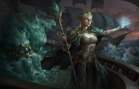

Jaina Valiente es la hechicera humana viva más poderosa de la actualidad. Pertenece al linaje de la Casa Valiente cuyos progenitores Daelin y Katherine han servido como gobernantes del reino humano de Kul Tiras. Hasta su reciente regreso a su hogar, ostentó importantes cargos como líder del Kirin Tor y gobernante de Theramore y de Dalaran.

Jaina fue una de las más talentosas y destacadas hechiceras de Dalaran, a las órdenes del gran archimago Antonidas que la envió al comienzo de la Tercera Guerra al reino de Lordaeron con el fin de descubrir qué ocurría tras unas revueltas campesinas. Mientras cumplía su misión, fue escoltada por su amigo de la infancia, el Príncipe Arthas Menethil, con quien tuvo una relación amorosa. Jaina recibió la visita de un misterioso profeta, que le enseñó el futuro, una visión donde se mostraba la caída de Lordaeron, y aceptó ir a Kalimdor para tratar de evitar la catástrofe con el máximo número de efectivos posible.

Jaina juró acabar con la Legión Ardiente y sus oscuros agentes. Uniendo fuerzas con los elfos de la noche e incluso con la Horda orca, Jaina ayudó a derrotar al demonio Archimonde y a desterrar a la Legión. Entonces reunió a los humanos supervivientes de Kalimdor y fundó la ciudad portuaria de Theramore. Desde ahí gobierna y espera reunir a los distantes reinos humanos una vez más.

Poco después de la caída de Alamuerte, la Horda bajo las órdenes de Garrosh Grito Infernal, realizó una incursión que acabo devastando Theramore. Jaina consiguió escapar con vida pero la experiencia la transformó, acabando con su caracter pacífico y cambiando su aspecto físico.

