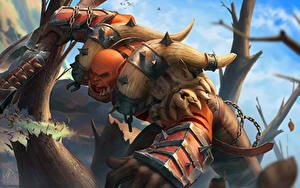

Garrosh Grito Infernal fue el Jefe de Guerra de la Horda, sucediendo a Thrall, tras la Devastación hasta que fue sucedido en el cargo por Vol'jin tras el Asedio de Orgrimmar. A lo largo de toda la historia de Azeroth, ha habido pocos mortales tan famosos como él.

Garrosh creció en Draenor a la sombra de su padre, el gran guerrero Grommash Grito Infernal. Como Jefe de Guerra del clan Grito de Guerra, Grom fue el primer líder orco que bebió la sangre de Mannoroth, subyugando a los orcos a la voluntad de la Legión. Antes de esto, Garrosh se encontraba entre el grupo de orcos que habían contraído la viruela roja. Habían estado en cuarentena en la lejana Nagrand, lo que les permitió escapar de la corrupción demoníaca. El joven Grito Infernal pasó años avergonzándose de su padre hasta que conoció a Thrall y se enteró de la heroica redención de Grom. Desde entonces Garrosh ha abrazado su potencial como líder fuerte, de forma más notable en Rasganorte, donde dirigió el avance de la Horda a través de la Tundra Boreal y se ganó los corazones de su gente. Inflexible y ferozmente orgulloso, Grito Infernal pretende restaurar la gloria de los orcos por cualquier medio.

Durante la nueva guerra contra la Alianza, la sed de poder de Garrosh lo corrompió hasta el punto de dejar de importarle los medios para conseguir sus fines que no eran otros que la supremacía de los orcos en Azeroth con él mismo como gobernante supremo. Esto provocó la liberación del corazón de un dios antiguo destruyendo el sagrado Valle de la Flor Eterna de los pandaren. Tras el levantamiento de la propia Horda y en coalición con la Alianza fue derrotado bajo Orgrimmar y enviado a Pandaria para ser juzgado por sus crímenes pero consiguió escapar con ayuda de Kairoz y el Vuelo Infinito hasta una versión alternativa de Draenor antes de la corrupción de los orcos.

Anticipándose a la Legión Ardiente, Garrosh contactó con los clanes orcos y juntos formaron la Horda de Hierro, a la que dotó de maquinaria y conocimientos de la época actual. Más tarde, envió un ejército comandado por Zaela a través del Portal Oscuro para destruir Ventormenta pero el ataque fue repelido y los ejércitos de Azeroth penetraron en el Draenor alternativo donde Thrall lo derrotó en un mak'gora.

